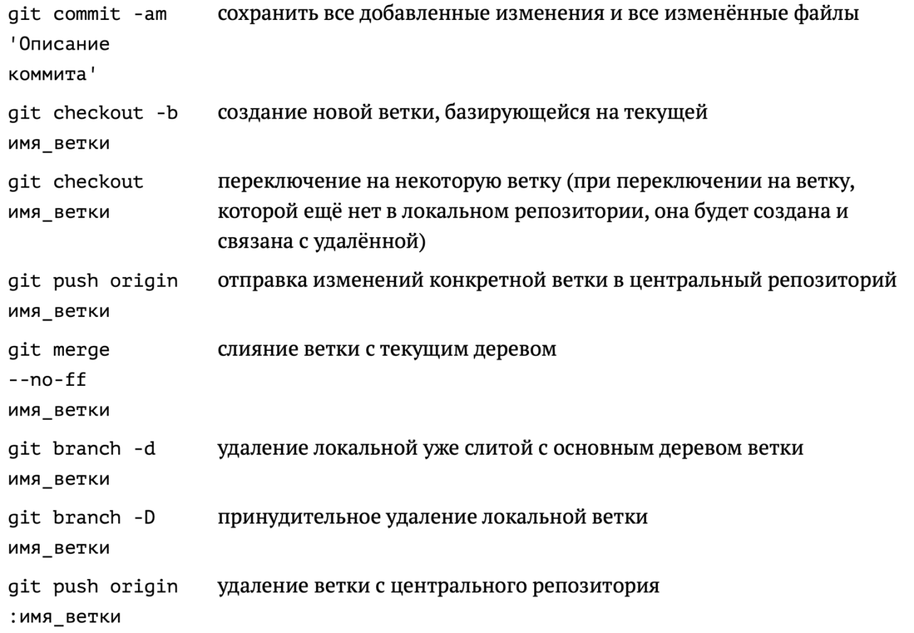
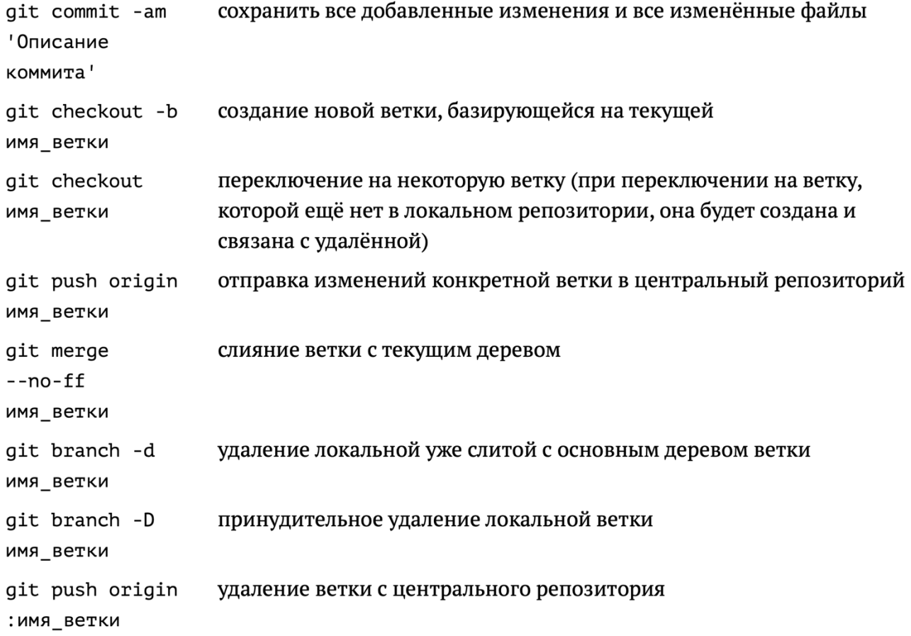
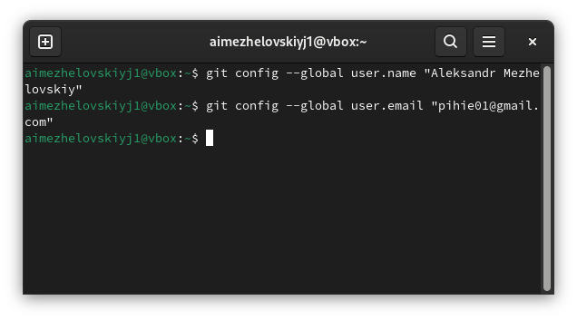
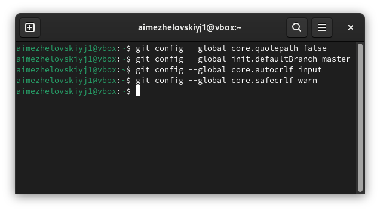
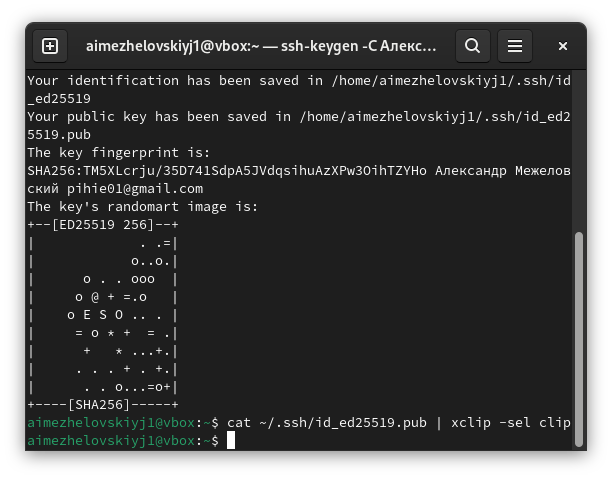
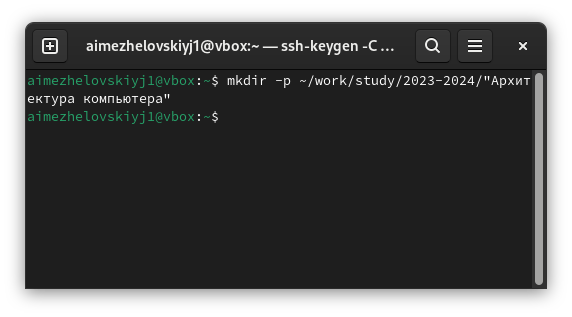
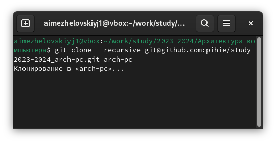
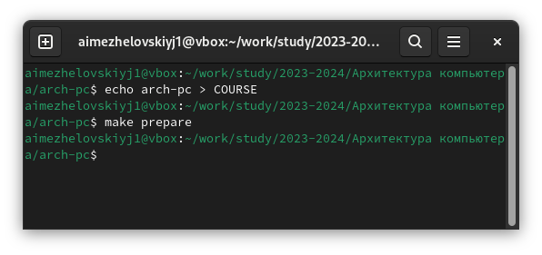
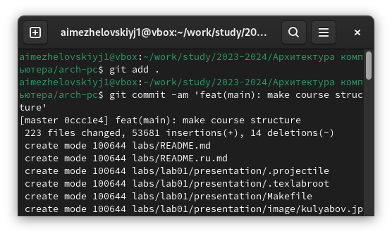
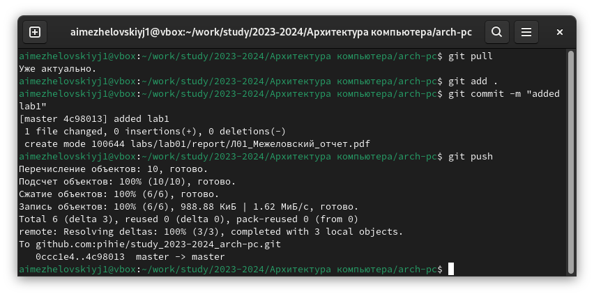

---
## Front matter
title: "Отчет по лабораторной работе №2"
author: "Межеловский Александр Игоревич"

## Generic otions
lang: ru-RU
toc-title: "Содержание"

## Bibliography
bibliography: bib/cite.bib
csl: pandoc/csl/gost-r-7-0-5-2008-numeric.csl

## Pdf output format
toc: true # Table of contents
toc-depth: 2
lof: true # List of figures
lot: true # List of tables
fontsize: 12pt
linestretch: 1.5
papersize: a4
documentclass: scrreprt
## I18n polyglossia
polyglossia-lang:
  name: russian
  options:
	- spelling=modern
	- babelshorthands=true
polyglossia-otherlangs:
  name: english
## I18n babel
babel-lang: russian
babel-otherlangs: english
## Fonts
mainfont: IBM Plex Serif
romanfont: IBM Plex Serif
sansfont: IBM Plex Sans
monofont: IBM Plex Mono
mathfont: STIX Two Math
mainfontoptions: Ligatures=Common,Ligatures=TeX,Scale=0.94
romanfontoptions: Ligatures=Common,Ligatures=TeX,Scale=0.94
sansfontoptions: Ligatures=Common,Ligatures=TeX,Scale=MatchLowercase,Scale=0.94
monofontoptions: Scale=MatchLowercase,Scale=0.94,FakeStretch=0.9
mathfontoptions:
## Biblatex
biblatex: true
biblio-style: "gost-numeric"
biblatexoptions:
  - parentracker=true
  - backend=biber
  - hyperref=auto
  - language=auto
  - autolang=other*
  - citestyle=gost-numeric
## Pandoc-crossref LaTeX customization
figureTitle: "Рис."
tableTitle: "Таблица"
listingTitle: "Листинг"
lofTitle: "Список иллюстраций"
lotTitle: "Список таблиц"
lolTitle: "Листинги"
## Misc options
indent: true
header-includes:
  - \usepackage{indentfirst}
  - \usepackage{float} # keep figures where there are in the text
  - \floatplacement{figure}{H} # keep figures where there are in the text
---

# Цель работы

Целью работы является изучить идеологию и применение средств контроля версий. Приобрести практические навыки по работе с системой git.

# Задание

1. Настройка GitHub
2. Базовая настройка git
3. Создание SHH ключа
4. Создание рабочего пространства и репозитория курса на основе шаблона
5. Создание репозитория курса на основе шаблона
6. Настройка каталога курса

# Теоретическое введение

# Выполнение лабораторной работы

Учетная запись github у меня уже была поэтому пропускаю этот шаг. Произвожу первоначальную настройку git. (Рис. 3, Рис. 4)

Создаю ключ ssh. (Рис. 5)

Создаю директорию в которой будет храниться копия репозитория. (Рис. 6)

Клонирую репозиторий в раннее созданную папку. (Рис. 7)

Создаю необходимые каталоги. (Рис. 8)

Сохраняю проделанные изменения, отправляю файлы на сервер. (Рис. 9)

# Выполнение самостоятельной работы

Самостоятельная работа предполагает загрузку этой лабораторной работы на github, поэтому не смогу прикрепить фото. Но вот как это делается на примере прошлой лабораторной работы. (Рис. 10)

# Выводы

Во время данной работы я изучил идеологию и применение средств контроля версий. Приобрел практические навыки по работе с системой git.