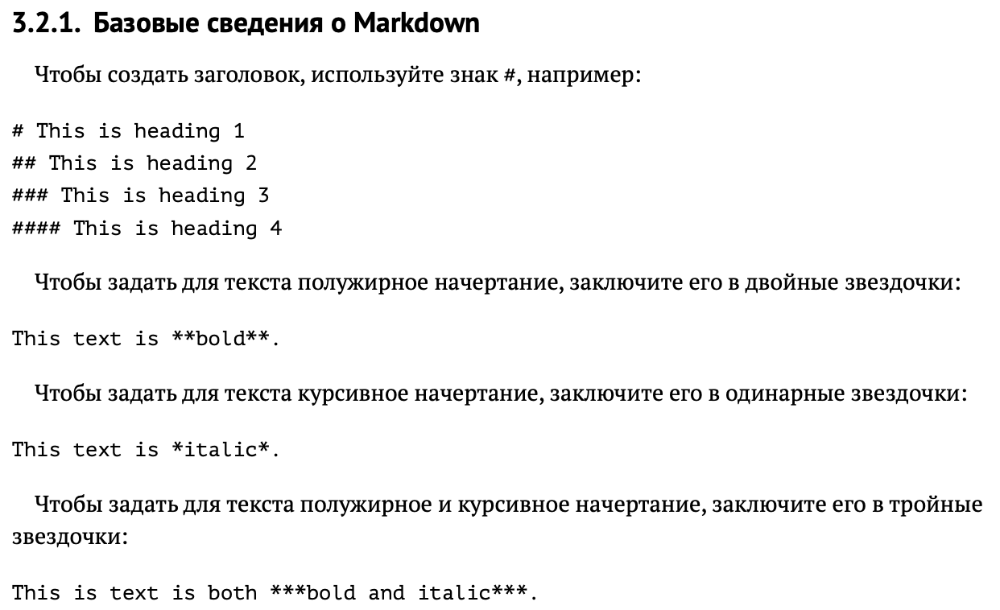
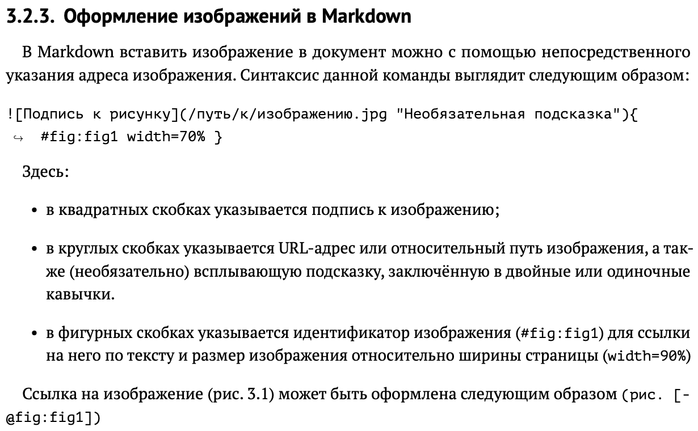
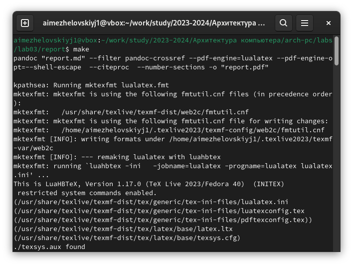

---
## Front matter
title: "Шаблон отчёта по лабораторной работе"
subtitle: "Простейший вариант"
author: "Дмитрий Сергеевич Кулябов"

## Generic otions
lang: ru-RU
toc-title: "Содержание"

## Bibliography
bibliography: bib/cite.bib
csl: pandoc/csl/gost-r-7-0-5-2008-numeric.csl

## Pdf output format
toc: true # Table of contents
toc-depth: 2
lof: true # List of figures
lot: true # List of tables
fontsize: 12pt
linestretch: 1.5
papersize: a4
documentclass: scrreprt
## I18n polyglossia
polyglossia-lang:
  name: russian
  options:
	- spelling=modern
	- babelshorthands=true
polyglossia-otherlangs:
  name: english
## I18n babel
babel-lang: russian
babel-otherlangs: english
## Fonts
mainfont: IBM Plex Serif
romanfont: IBM Plex Serif
sansfont: IBM Plex Sans
monofont: IBM Plex Mono
mathfont: STIX Two Math
mainfontoptions: Ligatures=Common,Ligatures=TeX,Scale=0.94
romanfontoptions: Ligatures=Common,Ligatures=TeX,Scale=0.94
sansfontoptions: Ligatures=Common,Ligatures=TeX,Scale=MatchLowercase,Scale=0.94
monofontoptions: Scale=MatchLowercase,Scale=0.94,FakeStretch=0.9
mathfontoptions:
## Biblatex
biblatex: true
biblio-style: "gost-numeric"
biblatexoptions:
  - parentracker=true
  - backend=biber
  - hyperref=auto
  - language=auto
  - autolang=other*
  - citestyle=gost-numeric
## Pandoc-crossref LaTeX customization
figureTitle: "Рис."
tableTitle: "Таблица"
listingTitle: "Листинг"
lofTitle: "Список иллюстраций"
lotTitle: "Список таблиц"
lolTitle: "Листинги"
## Misc options
indent: true
header-includes:
  - \usepackage{indentfirst}
  - \usepackage{float} # keep figures where there are in the text
  - \floatplacement{figure}{H} # keep figures where there are in the text
---

# Цель работы

Целью работы является освоение процедуры оформления отчетов с помощью легковесного языка разметки Markdown.
# Задание
1. Практика создания отчета с помощью Makefile
2. Создание отчета в Markdown
3. Загрузка на Github

# Теоретическое введение

# Выполнение лабораторной работы
Перехожу в каталог с курса, куда был клонирован репозиторий. (Рис. 3)

Обновляю локальный репозиторий, скачав изменения из удалённого репозитория с помощью команды git pull. (Рис. 4)

Получаю сообщение "Уже актуально". Перехожу в каталог с 3 лабораторной работой. Создаю шаблон отчёта с помощью команды make. (Рис. 5)

Далее использую команду make clean чтобы удалить файлы report.pdf и report.docx. (Рис. 6)

Далее создаю отчет с помощью текстового редактора gedit. (Рис. 7)

# Выполнение самостоятельной работы
Аналогично этой лабораторной работе, создаю также в markdown отчет по 2 лабораторной работе и использую команду make чтобы создать отчет в форматах pdf и docx, 

# Выводы
В результате проделанной работы я освоил процедуру оформления отчетов с помощью легковесного языка разметки Markdown.
